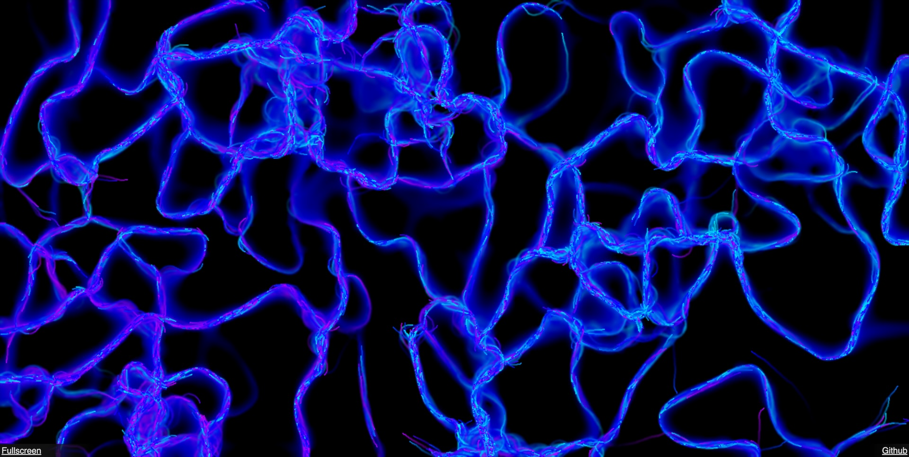

Ant Simulation
===

This is an ant, or slime-mold simulation that can be run in the browser. 
Under the hood it uses an older OpenGL 2.1 version and uses GLSL shaders
to run the simulation. Not compute shaders, actual vertex fragment shaders!
For IoT, where devices often have access to only OpenGL 2.1, this repository
can be used as a template for improving pathfinding through Ant colonty optimization.

This repository also sorves a great example for using Emscripten with WASM and OpenGL.

Read the full article explaining everything in detail [here](https://linkedin.com/pulse/general-purpose-gpu-programming-without-compute-shaders-sem-postma-enzre).
